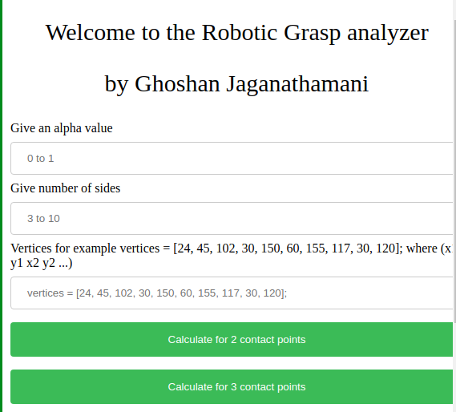

---

INTRODUCTION
============

Grasping and manipulation with complex grippers, such as multifingered
and/or under actuated hands, is an active research area in robotics. The
goal of a grasp is to achieve a desired object constraint in the
presence of external disturbances (including the object’s own weight).
Dexterous manipulation involves changing the object’s position with
respect to the hand without any external support.

RELATED WORK
============

In this paper our focus is the interaction between the robot and its
environment. The desired behavior of the robot hand or end-effector, the
contact interface between the robot and objects. The focus is on
manipulation. We will assume that the manipulator, objects, and
obstacles in the environment are rigid. The key aspects of robotics
grasping are that,

Disturbance resistance
----------------------

A grasp can resist disturbances in any direction when object immobility
is ensured, either by finger positions (form closure) or, up to a
certain magnitude, by the forces applied by the fingers (force closure).
Main problem: determination of contact points on the object boundary.

Dexterity
---------

A grasp is dexterous if the hand can move the object in a compatible way
with the task to be performed. When there are no task specifications, a
grasp is considered dexterous if the hand is able to move the object in
any direction. Main problem: determination of hand configuration.

Equilibrium
-----------

A grasp is in equilibrium when the resultant of forces and torques
applied on the object (by the fingers and external disturbances) is
null. Main problem: determination and control of the proper contact
forces.

Stability
---------

A grasp is stable if any error in the object position caused by a
disturbance disappears in time after the disturbance vanishes. Main
problem: control of restitution forces when the grasp is moved away from
equilibrium.

UI
==

The user of the program is greeted with a simple website built using
HTML and JavaScript for maximum portability. By using JavaScript the
program can be embedded in websites, allowing if to be highly portable.
The sketching library used in this case is [two.js]{}, a simple 2D
sketching suite. The user for example can input a set of instructions in
the respective boxes in the following manner.

[alpha : 0.7,\
number of sides : 5,\
vertices: 24 45 102 30 150 60 155 117 30 120]{}

{width="7cm"}

2 CONTACT POINT GRASP
=====================

The user inputs the friction coefficient (alpha) and the number of sides
the polygon should be. Then the user needs to input the x,y vertices
coordinates of the polygon. After the polygon is constructed(make sure
the polygon is not self intersecting), the polygon will be displayed on
the screen.

After the polygon sides are constructed, each side has evenly spaced 9
points. So if it is a 5 sided polygon, there will be totally 45 ( 9 \* 5
) points. Then a point is chosen in random using the [Math.rand()]{}
function. The selected point [p1]{} will then be checked with all the
other points for force closure.

The wrench matrix is constructed from the 2 contact points. The
coefficient of friction produces the alpha angle. The two contact points
yield force close if

-   rank F = n

-   there exists a solution to linear optimization to find the minimum
    for the given wrench matrix.

If the given two contact points yield force closure, a line is drawn
between the points indicating compatibility. The points are stored in a
multidimensional array where [points\[i\] = \[x coord, y coord, colour,
gradient of line, force closure\]]{}. The results are updated on each
calculation step. The user is able to click on the “Calculate for 2
contact points” button repeatedly to find another random point and
perform the analysis on the given point.

{width="4cm"} {width="4cm"}

3 CONTACT POINT GRASP
=====================

Similar to 2 contact point, 3 contact point is calculated with a given
random point and 2 compatible points are chosen. This is done
recursively when 2 contact points are compatible.

{width="4cm"} {width="4cm"}

QUALITY of GRASP
================

The quality of the grasp can be measured in many ways. The most accurate
way to measure the quality would be to create a 3D Sphere between the
contact points 3D wrench space. Since we assume for 2D space, the way to
calculate the quality is to find the area of the circle inscribed
between the wrench space of the compatible 2 or 3 contact points.
$$Q_{\tiny VOP}=\hbox {Area}(\mathcal{P})$$

A plot of for a given point is visualized as follows, where the
dependant axis shows all the points that are compare,and independent
axis has the the area of the circle inscribed by the wrench matrices.\

coordinates [
(0,0)(1,0)(2,0)(3,0)(4,0)(5,0)(6,0)(7,0)(8,0)(9,0)(10,0)(11,0)(12,0)(13,0)(14,0)(15,0)(16,27.5)(17,30)(18,31)(19,35)(20,0)(21,0)(22,0)(24,70)(25,80)(26,81)(27,85)(28,86)(29,90)(30,85)(31,84)(32,80)(33,70)(34,0)(35,0)(36,0)(37,0)(38,50)(39,40)(40,0)(41,0)(42,0)(43,0)(44,0)(45,0)
]{};

Another quality measure proposed for polyhedral objects and based on a
set ICRS is given by the sum of the distances between each one of the i
-th actual contact points (xi,yi) and the center of the corresponding
independent contact region (xi0,yi0,zi0) , i.e.\
$$Q_{\tiny ICR^{\prime \prime }}=\frac{1}{n}\sum \limits _{i=1}^{n}\sqrt{\left( x_i-x_{i0}\right) ^2+\left( y_i-y_{i0}\right) ^2]$$

CONCLUSION
==========

This paper has presented a simple wat to visualize and analyse grasping
a 2D polygon with 2 or 3 contact points. The most widely used grasp
classifications and closure properties can all be derived from these
models under the rigid-body assumption. Linearizing these models leads
to metrics and tests that can be computed efficiently using
computational linear algebra and linear programming techniques.

Other important research topics within the area of grasping are: grasp
synthesis, force distribution, stability, and dexterous manipulation.
Grasp synthesis is the problem of choosing the posture of the hand and
contact point locations to optimize a grasp quality metric.

The next step would be to prove the stability of the optimal grasp. This
could be done using a simulation of external forcesacting on the grasp.
To further improve on the grasp, it would be ideal to check the
dexterity for better motion planning. Dexterity of the grasp is ability
of the hand to move the object in a compatible way with the task to be
performed.

REFERENCES
==========

-   Grasp quality measures: review and performance, (Article)
    https://link.springer.com/article/10.1007/s10514-014-9402-

-   Modern Robotics, (Textbook)
    http://hades.mech.northwestern.edu/index.php/ModernRobotics

-   Force Closure grasp, (Article)
    http://www.centropiaggio.unipi.it/sites/default/files/grasp-IJRR95.pdf

-   Baker, B.S., Fortune, S., and Grosse, E. 1985. Stable Prehension
    with a Multifinngered Hand. Proc. IEEE Int. Conf. on Robotics and
    Automation, pp. 570[575.]{}

-   Fearing, R. 1986. Simplied Grasping and Manipulation with Dextrous
    Robot Hands. IEEE J. Robotics and Automation, vol. 2, no. 4, pp.
    188[195.]{}

[^1]: \*This work was not supported by any organization

[^2]: $^{1}$Ghoshan Jaganathamani is a 3rd year Computer Engineering
    Student, Hong Kong University of Science and Technology, Hong Kong
    [github.com/ghoshanjega]{}
